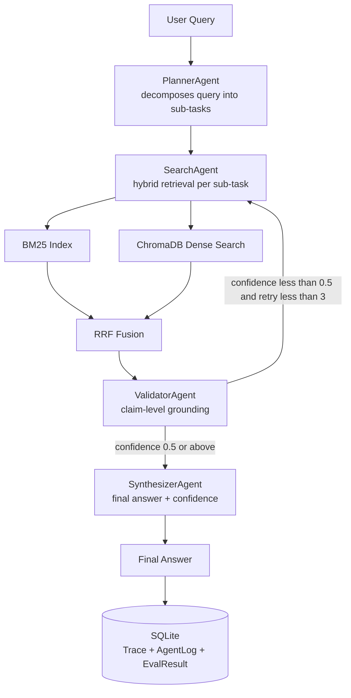
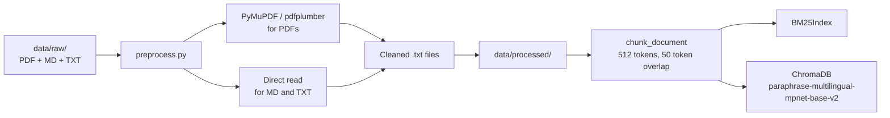
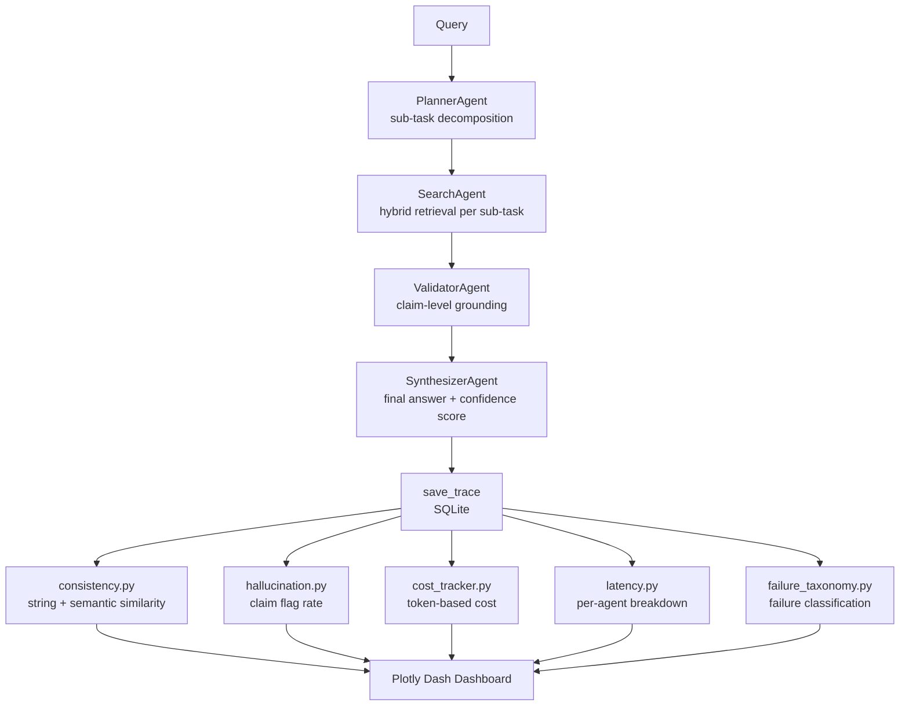
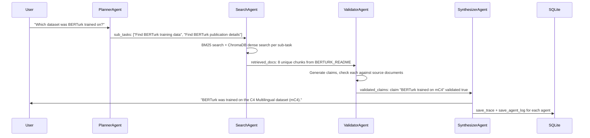
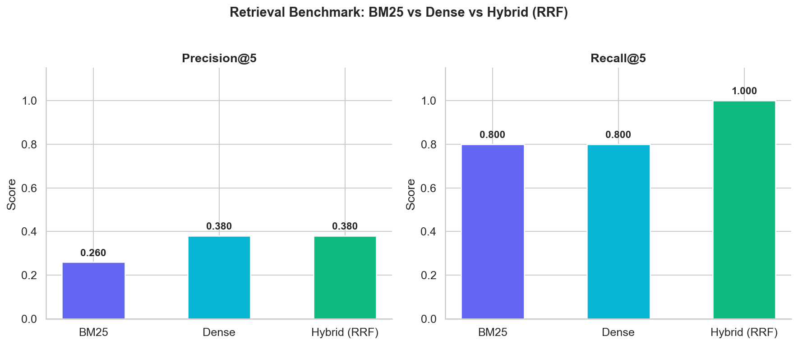
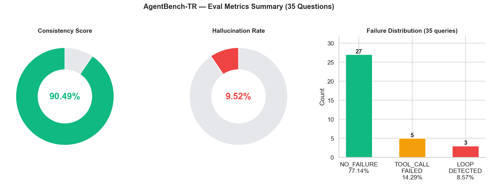
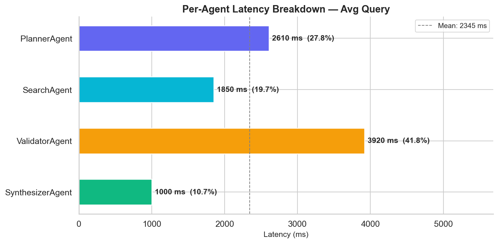
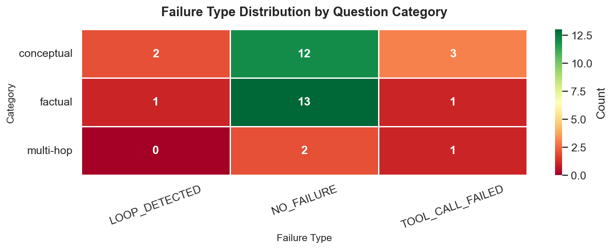

# AgentBench-TR

I built AgentBench-TR to answer a question I kept running into: how do you actually measure an LLM agent system before it goes to production? The project is a multi-agent Turkish question-answering system combined with an evaluation framework. It runs on LangGraph with a 4-agent pipeline, hybrid BM25 and vector retrieval using Reciprocal Rank Fusion, SQLite-based trace logging, and a Plotly Dash observability dashboard.

## Problem

LLM agent systems go to production with critical questions unanswered. Does the system give consistent answers to the same question? Does it generate information not present in source documents? What is the cost per query? Which agent creates the bottleneck? Which question category fails most often? AgentBench-TR answers these questions with measurable metrics derived from a full pipeline trace log.

## System Architecture



## Document Ingestion Workflow

The source documents are Turkish. I used a mix of my own university lecture notes on advanced networking and introductory AI, along with technical READMEs from my other projects including AeroGuard and BERTurk, and publicly available NLP papers and dataset descriptions.



## Query and Eval Pipeline



## Example Trace Walkthrough

This is what a single query looks like flowing through the full pipeline:



## Eval Methodology

I designed the evaluation layer to measure four dimensions independently for every trace, without modifying the pipeline itself.

**Consistency** is measured by running the same question through the pipeline multiple times and comparing answers pairwise. Two similarity scores are computed: string similarity using SequenceMatcher and semantic similarity using sentence-transformers cosine distance. The combined score is their average. A score of 1.0 means the system produces identical answers on every run.

**Hallucination rate** is derived from ValidatorAgent logs. For each query, the agent generates individual claims and checks whether each claim is grounded in the retrieved source documents. The hallucination rate is the ratio of ungrounded claims to total claims. This operates at claim level rather than document level, which gives a more precise signal than checking the answer as a whole.

**Cost** is calculated from token counts using a per-model price table defined in `eval/cost_tracker.py`. When actual token counts are unavailable, the system estimates from agent log lengths. Supported models include gpt-4o-mini, gpt-4o, claude-haiku, and claude-sonnet.

**Latency** is measured per agent. Each agent records its execution time in milliseconds into the AgentLog table. The breakdown shows each agent's share of total query time and identifies the bottleneck agent automatically.

## Retrieval: Hybrid vs Single-Method



I compared BM25, dense, and hybrid retrieval across 10 Turkish test questions with known ground truth sources. The results show that neither method alone is sufficient: BM25 misses semantically similar documents that do not share exact keywords, and dense search misses documents with precise terminology. Reciprocal Rank Fusion combines both ranked lists and rewards chunks that appear near the top in both methods. The hybrid approach achieved Recall@5 of 1.0, meaning the correct source was always retrieved within the top 5 results.

| Method       | Precision@5 | Recall@5 |
| ------------ | ----------- | -------- |
| BM25         | 0.260       | 0.800    |
| Dense        | 0.380       | 0.800    |
| Hybrid (RRF) | 0.380       | 1.000    |

## Agent Eval Benchmark

I ran the full pipeline across 35 Turkish questions spanning factual, conceptual, and multi-hop categories. Each question was evaluated for consistency, hallucination rate, cost, and latency.



| Metric                        | Value            |
| ----------------------------- | ---------------- |
| Consistency Score             | 0.9049           |
| Hallucination Rate            | 0.0952           |
| Avg Cost per Query            | $0.000057        |
| Avg Cost per Query (x10 runs) | $0.000567        |
| Avg Latency per Query         | 9,380 ms         |
| Bottleneck Agent              | Validator        |
| Failure Rate                  | 8 / 35           |
| Most Common Failure           | TOOL_CALL_FAILED |

## Latency Breakdown



ValidatorAgent accounts for the largest share of per-query latency. It makes one LLM call per query to generate and ground claims against source documents, which is the most token-intensive step in the pipeline. PlannerAgent and SynthesizerAgent are lighter calls with shorter prompts.

## Failure Taxonomy



| Failure Type     | Count | Pct    | Description                                        |
| ---------------- | ----- | ------ | -------------------------------------------------- |
| NO_FAILURE       | 27    | 77.14% | Pipeline completed successfully                    |
| TOOL_CALL_FAILED | 5     | 14.29% | Retrieval returned 0 chunks                        |
| LOOP_DETECTED    | 3     | 8.57%  | retry_count reached 3, confidence stayed below 0.5 |

TOOL_CALL_FAILED cases are concentrated in the conceptual category, where abstract phrasing reduces lexical overlap with source documents and retrieval returns fewer relevant chunks. LOOP_DETECTED cases occur when the validator consistently assigns low confidence across all retry attempts, typically on out-of-domain questions.

## Project Structure

```
AgentBench-TR/
├── agents/
│   ├── planner.py          # Query to sub-tasks
│   ├── search.py           # Sub-tasks to hybrid retrieval
│   ├── validator.py        # Claim-level grounding
│   └── synthesizer.py      # Final answer and confidence score
├── graph/
│   ├── state.py            # AgentState dataclass
│   └── pipeline.py         # LangGraph StateGraph
├── retrieval/
│   ├── bm25_index.py       # BM25Okapi with chunking
│   ├── vector_store.py     # ChromaDB with sentence-transformers
│   └── hybrid.py           # Reciprocal Rank Fusion
├── storage/
│   ├── models.py           # Trace, AgentLog, EvalResult ORM
│   ├── database.py         # SQLite init and session management
│   └── trace_store.py      # CRUD operations
├── eval/
│   ├── consistency.py      # String and semantic similarity
│   ├── hallucination.py    # Flag rate from validator logs
│   ├── cost_tracker.py     # Token-based cost calculation
│   ├── latency.py          # Per-agent latency breakdown
│   └── failure_taxonomy.py # Failure classification
├── api/
│   ├── main.py             # FastAPI app
│   ├── schemas.py          # Pydantic models
│   └── routes/
│       ├── query.py        # POST /query
│       └── metrics.py      # GET /metrics and /traces
├── dashboard/
│   ├── app.py              # Plotly Dash app
│   └── components/
│       ├── trace_table.py
│       ├── consistency_chart.py
│       ├── cost_chart.py
│       └── failure_heatmap.py
├── data/
│   ├── raw/                # Source documents in Turkish
│   ├── processed/          # Cleaned txt files
│   ├── eval_questions.json # 35 test questions with ground truth
│   └── preprocess.py
├── notebooks/
│   ├── 01_EDA.ipynb
│   ├── 02_retrieval_benchmark.ipynb
│   ├── 03_agent_smoke_test.ipynb
│   ├── 04_eval_analysis.ipynb
│   └── 05_failure_analysis.ipynb
├── tests/
│   ├── test_retrieval.py
│   ├── test_agents.py
│   └── test_eval.py
├── results/
│   ├── retrieval_benchmark.csv
│   ├── retrieval_benchmark.png
│   ├── eval_results.csv
│   ├── eval_metrics_summary.png
│   ├── failure_taxonomy.csv
│   ├── failure_heatmap.png
│   ├── latency_breakdown.png
│   └── generate_figures.py
├── Dockerfile.api
├── Dockerfile.dashboard
├── docker-compose.yml
├── requirements.txt
└── .env.example
```

## Key Design Decisions

**Hybrid retrieval with RRF.** BM25 matches keywords while dense search captures semantic similarity. The two methods are complementary, and Reciprocal Rank Fusion produces a unified ranking that outperforms either method individually. This combination achieved Recall@5 of 1.0 on the benchmark.

**Claim-level validation.** I wanted hallucination detection to be precise rather than coarse. ValidatorAgent checks each claim in the generated answer against the source documents individually rather than evaluating the answer as a whole. This enables a per-trace hallucination rate metric at claim level.

**Retry loop with confidence threshold.** When the confidence score falls below 0.5, SearchAgent re-runs with a maximum of three retries. This filters low-confidence answers automatically before they reach the user and is logged as LOOP_DETECTED when the threshold is never crossed.

**Automatic trace logging.** Every agent execution, including its input, output, and latency, is written to SQLite automatically. Eval metrics are derived from these logs without adding a separate observability layer to the pipeline.

**Token-based cost tracking.** Input and output prices for each model are defined in the MODEL_PRICES dictionary. When actual token counts are unavailable, the system estimates cost from agent log character lengths.

## Setup

```bash
git clone https://github.com/burakkeynz/AgentBench-TR.git
cd AgentBench-TR
cp .env.example .env
# Add OPENAI_API_KEY to .env
docker compose up --build
```

API docs available at `http://localhost:8000/docs`

Dashboard available at `http://localhost:8050`

### Local Setup (without Docker)

```bash
pip install -r requirements.txt
uvicorn api.main:app --reload
python dashboard/app.py
```

### Reproduce Figures

```bash
python results/generate_figures.py
```

## Example Usage

```python
from graph.pipeline import build_graph
from graph.state import AgentState

graph = build_graph()
state = AgentState(query="Which dataset was BERTurk trained on?")
result = graph.invoke(state)

print(result["final_answer"])
# "BERTurk was trained on the C4 Multilingual dataset (mC4)."
print(result["confidence_score"])
# 1.0
```

```bash
curl -X POST http://localhost:8000/query \
  -H "Content-Type: application/json" \
  -d '{"query": "What is the attention mechanism in transformers?"}'
```

```json
{
  "answer": "The attention mechanism allows the model to weight relevant tokens dynamically...",
  "confidence": 1.0,
  "trace_id": "a3f2c1d4-..."
}
```

## Tests

```bash
pytest tests/ -v
# 22 passed in 2.64s
```
